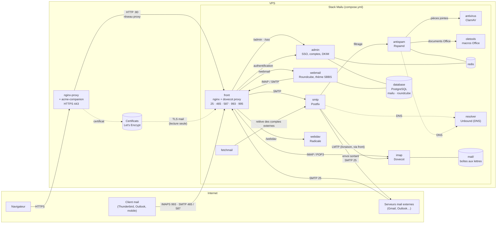

# Config mailu

Stack mail Mailu exécutée en local sur macOS / Docker Desktop, qui sert de
banc d'essai avant un déploiement sur un VPS.

## Architecture

Flux sur le serveur (`mail.sbbs-technology.com`). En local, nginx-proxy est
absent : le navigateur joint `front` directement sur 80.



## Organisation

```
mailu/
  compose.yml        définition de la stack (13 services)
  mailu.env          valeurs de configuration (--env-file) — SECRETS, ignoré par git
  mailu.env.example  modèle sans secrets, versionné
  mailu.env.server.example  modèle serveur (sbbs-technology.com), voir docs/deploy-mailu.md
  overrides/         surcharges de config par service, montées en lecture seule
                     (overrides/roundcube/skins/sbbs : thème du webmail)
  postgres/initdb/   crée les rôles et bases mailu + roundcube au premier démarrage
  scripts/backup.sh  sauvegarde bases + mails + DKIM + config (voir « Sauvegardes »)
  scripts/build-skin.sh  compile le thème du webmail (voir « Apparence »)
  scripts/build-login.sh compile les styles Tailwind de la page de connexion
  scripts/export-webmail-prefs.sh  préférences webmail par défaut (voir « Préférences du webmail »)
  certs/ dkim/       générés à l'exécution (contenu ignoré par git)
  data/ mail/ filter/ redis/ webmail/ clamav/ dav/   état, ignoré par git
```

Deux éléments d'état sont stockés dans des volumes Docker nommés plutôt que
dans des bind mounts, car leur propriétaire doit pouvoir les `chown`, ce qu'un
bind mount macOS refuse : `mailqueue` (file d'attente postfix) et `pgdata`
(PostgreSQL).

La stack se lance toujours en indiquant le fichier d'environnement :

```sh
cd mailu && docker compose --env-file mailu.env up -d
```

`mailu.env` ne contient que des **valeurs**. C'est `compose.yml` qui décide
quel service reçoit quelle variable, dans ses blocs `environment:` :

| Bloc / service      | Variables reçues                                          |
|---------------------|-----------------------------------------------------------|
| `x-mailu-env`       | config Mailu commune (domaine, TLS, limites, web…)        |
| `admin`             | commun + `DB_*` + `INITIAL_ADMIN_*`                       |
| `webmail`           | commun + `ROUNDCUBE_DB_*` + `ROUNDCUBE_PLUGINS`           |
| `front`             | commun + `VIRTUAL_*`, `LETSENCRYPT_HOST`, `TLS_*_FILENAME`|
| `fetchmail`         | commun + `FETCHMAIL_DELAY`                                |
| `resolver`, `imap`, `smtp`, `antispam` | commun seulement                       |
| `database`          | `POSTGRES_PASSWORD`, `DB_*`, `ROUNDCUBE_DB_*` (aucune config Mailu) |

Dans ces blocs :

- `VAR:` sans valeur reprend `VAR` de `mailu.env`. Absente de `mailu.env`,
  elle n'est pas définie dans le conteneur et Mailu applique sa valeur par
  défaut.
- `${VAR:?...}` est obligatoire (`SECRET_KEY`, `DOMAIN`, `HOSTNAMES`, mots de
  passe) : compose refuse de démarrer si elle manque.
- Ajouter une variable dans `mailu.env` ne suffit pas : il faut aussi la
  déclarer dans le bon bloc de `compose.yml`, sinon aucun conteneur ne la voit.

Pour un autre environnement, il suffit d'un autre fichier de valeurs :
`docker compose --env-file prod.env up -d`.

Toutes les commandes `docker compose` (y compris `ps`, `logs`, `exec`) ont
besoin de `--env-file`. Pour ne pas le répéter dans un terminal :

```sh
export COMPOSE_ENV_FILES=mailu.env   # depuis mailu/
```

## Base de données

Mailu (`admin`) et Roundcube (`webmail`) stockent leurs données dans PostgreSQL
(le service `database`), chacun dans sa propre base avec son propre rôle,
configurés par les valeurs `DB_*` et `ROUNDCUBE_DB_*` de `mailu.env`. Le script
d'initialisation ne s'exécute que sur un volume `pgdata` vide : après le
premier démarrage, changer un mot de passe dans `mailu.env` demande aussi un
`ALTER ROLE`, ou une remise à zéro du volume :

```sh
cd mailu && docker compose --env-file mailu.env down && docker volume rm mailu_pgdata
```

Ouvrir un shell SQL :

```sh
cd mailu && docker compose --env-file mailu.env exec database psql -U postgres -d mailu
```

## Premier lancement

```sh
cp mailu/mailu.env.example mailu/mailu.env   # puis renseigner les secrets
openssl rand -base64 16                      # -> SECRET_KEY
openssl rand -hex 16                         # -> chaque *_PW / POSTGRES_PASSWORD
docker network create nginx-proxy              # une seule fois, voir « Passage en production »
cd mailu && docker compose --env-file mailu.env up -d
```

Le nom d'hôte web doit être déclaré en local dans `/etc/hosts` :

```
127.0.0.1  mail.localhost.com
```

Le premier démarrage télécharge environ 2 Go d'images. ClamAV télécharge
ensuite sa base de signatures, ce qui prend plusieurs minutes ; `antispam`
démarre tout de suite et journalise des échecs d'analyse tant que `antivirus`
n'est pas prêt. Pour suivre :

```sh
cd mailu && docker compose --env-file mailu.env logs -f front admin antispam
```

## Ports de l'hôte

En local, chaque port est publié à l'identique sur toutes les interfaces : la
stack est donc joignable depuis le réseau local, pas seulement depuis cette
machine. Chaque port mail est une variable de `mailu.env` (`SMTP_PORT`,
`IMAP_PORT`…) au format `[ip:]port`, pour pouvoir en fermer sur le serveur
(voir « Sécurité »).

| Service     | Port | Service     | Port |
|-------------|------|-------------|------|
| http        | 80   | pop3        | 110  |
| https       | 443  | pop3s       | 995  |
| smtp        | 25   | imap        | 143  |
| submissions | 465  | imaps       | 993  |
| submission  | 587  | managesieve | 4190 |

- Administration : <http://mail.localhost.com/admin>
- Webmail : <http://mail.localhost.com/webmail>

Les ports inférieurs à 1024 sont souvent déjà occupés sur un Mac — vérifier
avec `lsof -iTCP:80 -sTCP:LISTEN` avant de démarrer. La plupart des FAI
bloquent aussi le port 25 sortant : les mails vers l'extérieur ne quitteront
pas la machine.

`TLS_FLAVOR=notls` : les ports TLS uniquement (465 / 995 / 993) acceptent une
connexion mais ne peuvent pas terminer la négociation TLS. Tester sur
25 / 587 / 143.

## Test rapide

```sh
nc -z 127.0.0.1 25 && echo "smtp joignable"
curl -sI http://mail.localhost.com/admin | head -1
swaks --to admin@mail.localhost.com --server 127.0.0.1:25    # si swaks est installé
```

Avant chaque démarrage, vérifier que la configuration atteint bien les
conteneurs — une inspection de l'éditeur a déjà supprimé ces lignes sans
prévenir. Cette commande compte les services qui reçoivent réellement la
config Mailu commune une fois les anchors résolues par compose :

```sh
cd mailu && docker compose --env-file mailu.env config | grep -c '^      DOMAIN:'   # attendu : 8
```

## Version allégée

ClamAV occupe à lui seul environ 1,5 Go de mémoire. Pour retirer l'antivirus
et l'analyse des macros, modifier **les deux** fichiers ensemble — laisser
`ANTIVIRUS=clamav` alors que le conteneur n'existe plus fait que rspamd met
les mails en attente :

- `mailu.env` : `ANTIVIRUS=none`, `SCAN_MACROS=false`, `FULL_TEXT_SEARCH=off`
- `compose.yml` : supprimer les services `antivirus` et `oletools`, leurs
  entrées `depends_on` dans `antispam`, et les réseaux `clamav` / `oletools`.

## Passage en production

Procédure pas à pas pour `sbbs-technology.com` : [docs/deploy-mailu.md](docs/deploy-mailu.md).

Sur le serveur, Mailu tourne derrière nginx-proxy + acme-companion, déjà en
place. Tout se règle dans le `mailu.env` du serveur ; `compose.yml` ne change
pas.

`VIRTUAL_HOST`, `VIRTUAL_PORT` et `LETSENCRYPT_HOST` ne sont transmis qu'au
service `front` : nginx-proxy ne route le domaine que vers lui. `front` rejoint aussi le réseau de
nginx-proxy (`PROXY_NETWORK`). En local, ce réseau doit exister :
`docker network create nginx-proxy`.

Dans `mailu.env` du serveur :

- Proxy :
  - `VIRTUAL_HOST` et `LETSENCRYPT_HOST` = le nom public
    (le même que `HOSTNAMES`) ;
  - `FRONT_HTTP_PORT=127.0.0.1:8080` et `FRONT_HTTPS_PORT=127.0.0.1:8443` :
    80 / 443 appartiennent à nginx-proxy ;
  - `PROXY_NETWORK` = le réseau de nginx-proxy (`docker network ls`).
- TLS mail avec le certificat d'acme-companion :
  - `FRONT_CERTS_DIR` = le répertoire des certificats d'acme-companion sur
    l'hôte (pour un volume nommé : `docker volume inspect <volume> -f
    '{{.Mountpoint}}'`) ;
  - `TLS_FLAVOR=mail`, `TLS_CERT_FILENAME=<domaine>.crt`,
    `TLS_KEYPAIR_FILENAME=<domaine>.key` (liens posés par acme-companion à la
    racine de son répertoire ; pas `<domaine>/fullchain.pem`, dont Mailu
    surveille le dossier, absent au premier démarrage). Au premier démarrage, le
    certificat n'existe pas encore : le frontal démarre sans TLS mail, et le
    proxy IMAP / POP3 (dovecot) ne démarre pas. Une fois le certificat obtenu,
    redémarrer `front` une fois ; les renouvellements sont ensuite pris en
    compte seuls.
- Vraie IP des clients web : `REAL_IP_HEADER=X-Forwarded-For` et
  `REAL_IP_FROM` = le sous-réseau de `PROXY_NETWORK`
  (`docker network inspect <réseau> -f '{{(index .IPAM.Config 0).Subnet}}'`).
- `SESSION_COOKIE_SECURE=True`, `WEBSITE=https://...`, le vrai `DOMAIN` /
  `HOSTNAMES`, et de nouveaux `SECRET_KEY`, `INITIAL_ADMIN_PW` et mots de
  passe de base.
- Les réglages de la section « Sécurité » ci-dessous.

Puis publier les enregistrements DNS : A / AAAA, MX, SPF (`-all`), DKIM,
DMARC (`p=quarantine`, puis `p=reject`) et PTR.

## Sécurité

### Ports exposés

Docker publie ses ports en contournant `ufw` : un port publié est ouvert même
si le pare-feu le refuse. C'est donc dans `mailu.env` qu'on ferme. Sur le
serveur, ne garder publics que 25, 465, 587, 993 (et 995 si POP3) :

```
POP3_PORT=127.0.0.1:110          # POP3 en clair
IMAP_PORT=127.0.0.1:143          # IMAP en clair
SIEVE_PORT=127.0.0.1:4190        # ManageSieve, sauf si les clients s'en servent
PORTS=25,80,443,465,587,993,995  # ports écoutés par front
FRONT_HTTP_PORT=127.0.0.1:8080   # web joignable seulement via nginx-proxy
FRONT_HTTPS_PORT=127.0.0.1:8443
```

Vérifier depuis une autre machine : `nmap -p 25,110,143,465,587,993,995,4190,8080 <ip>`.

### Authentification

- `REAL_IP_HEADER=X-Forwarded-For` et `REAL_IP_FROM` (voir « Passage en
  production ») : sans eux, la limitation par IP voit tout le monde avec
  l'IP de nginx-proxy.
- `AUTH_RATELIMIT_IP` / `AUTH_RATELIMIT_USER` : échecs tolérés avant blocage.
- `AUTH_REQUIRE_TOKENS=true` : les clients IMAP / SMTP utilisent un jeton
  créé dans l'admin (révocable) au lieu du mot de passe du compte.
- Activer la double authentification (2FA) sur le compte admin si la version
  de Mailu la propose.
- `API=false` tant que l'API n'est pas utilisée.
- `/admin` est public derrière nginx-proxy : le restreindre (IP ou
  authentification HTTP) dans la configuration de nginx-proxy, ou au moins
  changer `WEB_ADMIN`.

### TLS sortant

`OUTBOUND_TLS_LEVEL=encrypt` refuse d'envoyer vers un serveur qui ne chiffre
pas ; vide, le chiffrement est opportuniste (plus compatible).

### Secrets

- `chmod 600 mailu.env` sur le serveur.
- Ne jamais réutiliser les secrets locaux ; tous les régénérer.

### Images

`MAILU_VERSION`, `redis` et `postgres` sont épinglés à une version exacte :
une mise à jour est un changement volontaire (et commité). Suivre les
versions de Mailu : <https://github.com/Mailu/Mailu/releases>. Changer de
version majeure de PostgreSQL (16 → 17) demande un dump / restore.

### Chiffrement

**Données stockées** — seuls les mots de passe sont protégés par Mailu :

| Donnée | Chiffrée ? | Détail |
|---|---|---|
| Mots de passe des comptes | ✅ hachés | bcrypt (`$bcrypt-sha2`) : vérifiables, pas récupérables |
| Mails (`mail/`) | ❌ | lisibles tels quels ; `COMPRESSION=gzip` compresse, ne chiffre pas |
| PostgreSQL (`pgdata`) | ❌ | comptes, alias, carnet d'adresses, préférences Roundcube |
| Clés DKIM, `mailu.env` | ❌ | protégés par les seules permissions (`chmod 600`) |
| Sauvegardes | ⚠️ | chiffrées seulement avec `AGE_RECIPIENT` |

**Données en transit** :

| Trajet | Local | Serveur |
|---|---|---|
| Client mail ↔ Mailu (IMAP / SMTP) | ❌ `TLS_FLAVOR=notls` | ✅ TLS (465 / 587 / 993 / 995) avec `TLS_FLAVOR=mail` |
| Navigateur ↔ webmail / admin | ❌ HTTP | ✅ HTTPS terminé par nginx-proxy |
| Mailu ↔ autres serveurs mail | — (port 25 bloqué) | ✅ opportuniste, ou obligatoire avec `OUTBOUND_TLS_LEVEL=encrypt` |
| Entre conteneurs (proxy → front, admin → PostgreSQL) | ❌ | ❌, sur des réseaux Docker internes non exposés |

**Configuration conseillée sur le serveur** :

1. **Disque chiffré (LUKS)**, ou volume chiffré proposé par l'hébergeur :
   protège mails, base, clés et sauvegardes locales en cas de vol du disque
   ou d'une copie du serveur. Transparent pour Mailu.
2. **Sauvegardes toujours chiffrées** (`AGE_RECIPIENT`), clé privée conservée
   hors du serveur.
3. **PGP de bout en bout** pour les échanges sensibles : le plugin `enigma`
   de Roundcube est activé (Paramètres → Chiffrement). Seul moyen pour que le
   serveur lui-même ne puisse pas lire un mail ; le correspondant doit aussi
   utiliser PGP.

Le chiffrement des boîtes par Dovecot (`mail_crypt`) n'est pas pris en charge
par Mailu et garderait ses clés sur le même serveur : le chiffrement du disque
couvre le même risque plus simplement. Dans tous les cas, l'administrateur du
serveur peut lire les mails, sauf ceux chiffrés en PGP.

## Apparence

Le webmail est Roundcube (`WEBMAIL=roundcube`) avec le thème SBBS : Elastic
recompilé avec une mise en page épurée, dans l'esprit de Gmail / Proton :

- fonds clairs et neutres, violet réservé aux actions et à la sélection ;
- menu latéral clair, petites icônes avec libellé à droite, « Rédiger » en
  bouton principal, « À propos » masqué ;
- bouton du plugin Mailu renommé « Mon compte » (icône de compte) : il ouvre
  la gestion du compte (mot de passe, réponse automatique, comptes externes,
  jetons) ;
- menu réductible (bouton ☰ en haut du menu) : icônes seules, choix mémorisé
  dans le navigateur ; au survol, le menu réduit se déplie par-dessus la
  colonne voisine avec ses libellés, sans décaler la mise en page ; sur tablette et téléphone, comportement d'Elastic ;
- bouton clair / sombre en haut à droite de l'écran ;
- barres d'outils en icônes seules (libellés en infobulle et pour les
  lecteurs d'écran), sauf sur tablette et téléphone ;
- dossier courant en pastille, recherche arrondie, listes plus aérées ;
- mode sombre accordé à la page de connexion. Le thème suit le système tant
  que l'utilisateur n'a pas choisi (bouton du menu ou de la page de
  connexion : même cookie `colorMode`).

```
overrides/roundcube/skins/sbbs/
  styles/_variables.less   palette claire et sombre (variables d'Elastic)
  styles/_styles.less      mise en page (menu, barres d'outils, listes, sombre)
  styles/styles.less       point d'entrée : Elastic + les deux fichiers ci-dessus
  styles/styles.min.css    CSS compilé, commité (le serveur n'a pas besoin de Node)
  meta.json                nom du produit et logos (bloc "config")
  images/                  logos SVG
  watermark.html           filigrane du volet de lecture vide
  templates/includes/menu.html  menu latéral d'Elastic + bouton ☰ (réduire)
```

Ces fichiers sont montés par-dessus ceux d'Elastic dans `compose.yml`.
`templates/includes/menu.html` est une copie du template d'Elastic avec le
bouton ☰ en plus : à recomparer avec l'original à chaque mise à jour de
`MAILU_VERSION`. Le JavaScript de ce bouton ne peut pas être injecté par
`front`, les pages du webmail arrivant compressées. Pas de
fichier `.inc.php` : le durcissement PHP de l'image (snuffleupagus) refuse
d'exécuter un fichier de config monté depuis l'hôte, et le webmail répond
alors 500. Le bloc `config` de `meta.json` est appliqué par Roundcube à toute
l'application, ce qui suffit pour le nom et les logos.

Après une modification d'un `.less` :

```sh
cd mailu && ./scripts/build-skin.sh   # Node / npx requis ; la stack peut être arrêtée
```

Le script compile contre les sources d'Elastic de l'image webmail de
`MAILU_VERSION` (téléchargée si besoin) : le relancer aussi après chaque mise
à jour de `MAILU_VERSION`. Les autres
fichiers (logos, `meta.json`, `watermark.html`) sont pris en compte au
rechargement de la page ; si un éditeur remplace le fichier au lieu de le
réécrire, redémarrer `webmail`.

### Page de connexion et administration Mailu

La page de connexion (SSO, commune au webmail et à l'admin) est remplacée par
`overrides/admin/login.html`, monté sur le template `sso/templates/login.html`
du service `admin`. La page de changement de mot de passe imposé
(`/sso/pw_change`) suit le même design, sans menu latéral :
`overrides/admin/pw_change.html`. Les deux partagent `sbbs_base.html` (mise en
page, pied de page) et `sbbs_macros.html` (champs avec icône, mot de passe
affichable, messages de Mailu traduits en français). Page de connexion : carte centrée sur fond dégradé, logo et nom centrés
au-dessus, bouton clair / sombre en haut à droite, affichage du mot de passe,
mention « © <année> <SITENAME> · Maintenu par SBBS Technology » en bas
(année calculée par le navigateur).
Mêmes
champs que l'original : la logique de Mailu (SSO, limitation des tentatives,
redirections, vérification des mots de passe compromis) ne change pas.

- Un seul bouton, « Se connecter », qui ouvre le webmail. L'admin n'est pas
  proposée sur la page : ouvrir `/admin` directement, Mailu redirige vers la
  connexion puis vers l'admin.
- Thème : celui du système par défaut ; le bouton clair / sombre enregistre
  le choix dans le cookie `colorMode`, le même que Roundcube : le webmail
  reprend le choix (et inversement).
- Pas de choix de langue : celle du navigateur s'applique.
- Liens « Conditions générales d'utilisation » et « Politique de
  confidentialité » en bas de page : URL dans `LEGAL_TERMS_ADDRESS` et
  `LEGAL_PRIVACY_ADDRESS` (`mailu.env`), lien masqué si vide. Les noms se
  terminent par `_ADDRESS` parce que Mailu ne transmet à ses templates que
  ses propres réglages et ces variables-là.
- « Un problème pour se connecter ? » écrit à `POSTMASTER@DOMAIN`.
- Logo : `LOGO_URL` s'il est défini, sinon l'icône SBBS intégrée ; nom :
  `SITENAME`.
- Les messages d'erreur de Mailu absents de sa traduction française sont
  traduits dans le template.
- Styles en Tailwind CSS (v3), compilés à l'avance : pas de CDN ni de
  dépendance externe sur la page. Sources dans `overrides/admin/tailwind/`
  (`tailwind.config.js` : couleurs SBBS, mode sombre sur `data-theme`),
  résultat dans `overrides/admin/sbbs-login.css`, commité et monté dans
  `/static/` du service `admin`. Après une modification des classes :

  ```sh
  cd mailu && ./scripts/build-login.sh   # Node / npx requis
  docker compose --env-file mailu.env restart admin
  ```

- Icônes dans les champs (enveloppe, cadenas), sur le bouton et le lien
  d'aide : SVG intégrés, aucune police d'icônes chargée.
- Après une modification du template : `docker compose restart admin`
  (Flask garde les templates en mémoire). Si un éditeur remplace le fichier
  au lieu de le réécrire, le montage garde l'ancien : utiliser
  `docker compose up -d --force-recreate admin`. À revérifier à chaque mise à jour
  de `MAILU_VERSION`, le template d'origine pouvant évoluer.

L'administration a un thème épuré assorti (menu clair, « Déconnexion » en bas
du menu comme dans le webmail, menu réduit en icônes seules qui se déplie au
survol, cartes arrondies sans bordure bleue, tableaux allégés, bouton
principal violet, bouton clair / sombre dans la barre du haut, logo SBBS) : `overrides/admin/sbbs-admin.css`
et `sbbs-admin.js`, servis par `admin` sous `/static/` et chargés dans chaque
page par `overrides/nginx/admin-ui.conf`. Styles limités aux pages AdminLTE
(`body.sidebar-mini`) : la page de connexion n'est pas touchée. Le bandeau du
logo n'utilise plus `LOGO_BACKGROUND` dans l'admin (fond géré par le thème).
Modification des fichiers : recharger la page (Cmd+Shift+R), pas de
compilation.

`overrides/nginx/admin-ui.conf` masque, dans l'admin, le pied de page
(« Built with ♥ using Flask and AdminLTE », GitHub, version de Mailu) et les
liens Configuration client, Site web et Aide du menu : nginx (`front`) injecte
une règle CSS dans les pages qu'il relaie, sans toucher aux templates. Pas de
caractère `$` dans cette règle (nginx le lirait comme une variable et `front`
ne démarrerait plus).

## Préférences du webmail par défaut

Les préférences Roundcube d'un compte de référence (tri, fenêtres de lecture
et de rédaction, accusés de réception, correcteur, archivage…) servent de
valeurs par défaut à tous les comptes, existants comme futurs. Ce sont des
valeurs par défaut : chaque utilisateur peut les modifier, et un réglage
qu'il a déjà changé n'est pas touché.

1. Régler les préférences voulues dans le webmail du compte de référence.
2. Exporter (stack démarrée) :

   ```sh
   cd mailu
   ./scripts/export-webmail-prefs.sh                  # compte admin initial
   ./scripts/export-webmail-prefs.sh prenom@domaine   # ou un autre compte
   ```

   Produit `overrides/roundcube/sbbs-defaults.inc.php`, à commiter. Réglages
   propres à un compte exclus (jeton client, dossiers personnels).
3. Appliquer : `docker compose --env-file mailu.env up -d --force-recreate
   webmail` (sur le serveur : après `git pull`, même commande).

À chaque démarrage, le service ponctuel `webmail-config` copie
`overrides/roundcube/*.inc.php` dans le volume `webmail-overrides`
(propriétaire `nobody`, lecture seule), monté en lecture seule sur
`/overrides` du webmail. C'est la seule forme que le durcissement PHP de
l'image (snuffleupagus) accepte d'exécuter : il refuse tout fichier que le
processus peut modifier ou qui lui appartient, et l'initialisation de Mailu
tourne en root. Un fichier PHP monté directement depuis l'hôte fait donc
redémarrer `webmail` en boucle.

## Sauvegardes

```sh
cd mailu && ./scripts/backup.sh
```

Crée `backups/mailu-<date>.tar` avec les dumps des bases `mailu` et
`roundcube`, et `mail/`, `dkim/`, `dav/` et `mailu.env`. Les archives de plus
de 14 jours sont supprimées (`RETENTION_DAYS`). Avec `AGE_RECIPIENT=<clé
publique age>`, l'archive est chiffrée (`.tar.age`) : indispensable dès
qu'elle quitte le serveur, puisqu'elle contient les secrets et les mails.

Exemple de cron quotidien sur le serveur :

```
30 3 * * * cd /chemin/vers/mailu && AGE_RECIPIENT=age1... ./scripts/backup.sh >> backups/backup.log 2>&1
```

Restauration (stack arrêtée sauf `database`) :

```sh
tar xf mailu-<date>.tar                          # après `age -d` si chiffrée
tar xzf files.tar.gz -C mailu/                   # mail/ dkim/ dav/ mailu.env
docker compose --env-file mailu.env exec -T database \
  pg_restore -U postgres -d mailu --clean --if-exists < db/mailu.dump
docker compose --env-file mailu.env exec -T database \
  pg_restore -U postgres -d roundcube --clean --if-exists < db/roundcube.dump
```

Tester une restauration au moins une fois, sur une autre machine.
